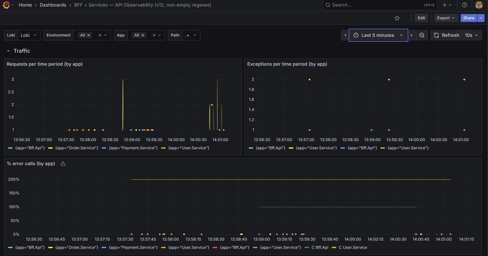
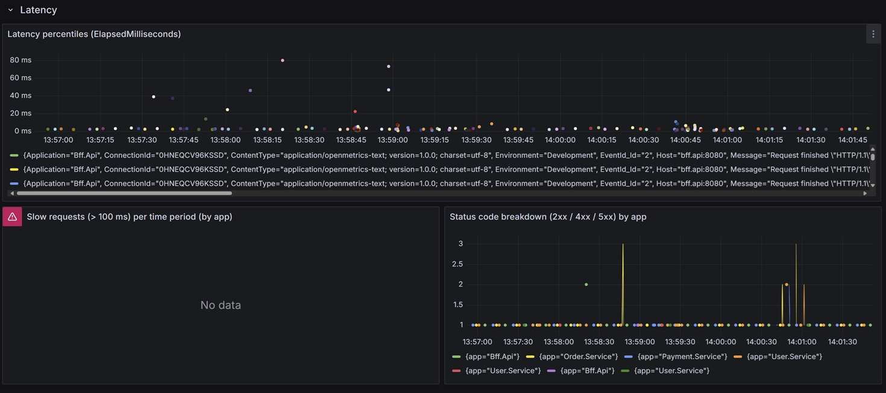
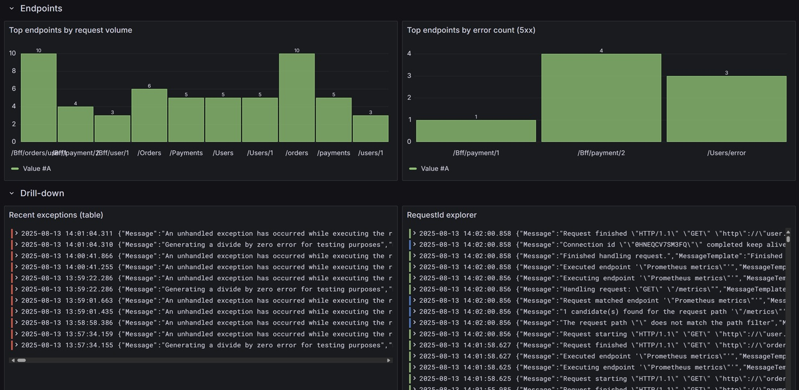

# C# Microservices Observability POC

## Overview

This repository contains a **proof-of-concept (POC)** microservices architecture implemented in C#/.NET 8, designed to demonstrate modern logging, metrics, alerting, and observability techniques using **Prometheus**, **Loki**, and **Grafana**.

The POC is intentionally small, yet realistic, and aims to showcase:

- Centralized **structured logging** with **correlation IDs** using **Serilog** piped to **Loki**.
- Service-level **Prometheus metrics** through `/metrics` endpoints.
- Real-time visualizations and **alerting** in **Grafana**.

This project is **also an experiment in AI context engineering**, using AI to plan, scaffold, and iteratively improve the architecture and codebase. All documentation and configuration are AI-assisted, with a focus on clear context and reproducibility.

---

## Architecture
- **User Service:** Handles user registration and info retrieval.
- **Order Service:** Manages orders, supports creating/fetching by user.
- **Payment Service:** Simulates processing payment for orders.
- **BFF (Backend For Frontend):** Provides a `/checkout` API orchestrating order creation and payment track events.
- **Frontend UI:** Simple interface for login, placing orders, and viewing paid/unpaid status.

All services use **.NET 8 Web APIs**.

**Note:** The `/checkout` and UI features have not been implemented because the simple backend services were enough to prove out the Loki / Grafana observability setup.

---

## Observability Stack
- **Logging:** Structured logs are sent to **Loki** (via Serilog), enriched with correlation IDs for cross-service traceability.
- **Metrics:** Each service exposes a `/metrics` endpoint for **Prometheus** to scrape.
- **Dashboards/Alerts:** **Grafana** provides dashboards and alert rules (for error rates, service unavailability, backlogs, etc).

All observability stack services are managed locally via **Docker Compose**.

---

## Running Locally

### Getting Started

 To verify the logs and metrics in Grafana:

   1. Access Grafana: Open your web browser and navigate to http://localhost:3000. The default credentials are
      admin/admin. You will be prompted to change the password on first login.

   2. Verify Data Sources:
       * Once logged in, go to "Configuration" (gear icon on the left sidebar) -> "Data Sources".
       * You should see "Prometheus" and "Loki" data sources listed and configured.

   3. Verify Logs (Loki):
       * Go to "Explore" (compass icon on the left sidebar).
       * Select the "Loki" data source.
       * On the right of the page there's a `Builder` and `Code` toggle, click `Code`.
       * Click on the query input and enter `{env="Development"}` to see logs from all services. You should see logs appearing from bff.api, order.service, payment.service, and user.service.

   4. Verify Metrics (Prometheus):
       * In "Explore", select the "Prometheus" data source.
       * Enter `http_requests_received_total` in the query field and run the query. You should see metrics data.

   5. Verify Custom Dashboard:
       * Go to "Dashboards" (dashboard icon on the left sidebar) -> "Browse".
       * You should find a dashboard named "BFF + Services API...". Click on it.
       * This dashboard should display traffic info, endpoint frequency and drill downs.

  To generate some logs and metrics, you can access the API endpoints:

   * Bff.Api: http://localhost:8080/swagger (and try the /Bff/user/{id} endpoint)
   * Order.Service: http://localhost:8081/swagger
   * Payment.Service: http://localhost:8082/swagger
   * User.Service: http://localhost:8083/swagger

  You can also directly access the Prometheus metrics endpoint for each service (e.g.,
  http://localhost:8080/metrics).

### Testing Scenarios

For detailed test scenarios to prove out the Grafana dashboard and observability features, refer to the [Grafana Scenarios documentation](./grafana-scenarios.md).

## Grafana Screenshots

Here are some screenshots of the Grafana dashboard:

### Other References

See `docker-compose.yml` for setup:

- Prometheus: `localhost:9090`
- Loki: `localhost:3100`
- Grafana: `localhost:3000` (admin/admin)

See also:
- [`prometheus.yml`](./prometheus.yml): Prometheus targets/services scraped
- [`loki-config.yaml`](./loki-config.yaml): Simple, local Loki setup

---

## Development Process

1. Scaffolded individual .NET 8 microservices for user, order, payment, and BFF API.

4. Implemented structured logging and metrics endpoints.
5. Deployed observability stack (Prometheus + Loki + Grafana) via Docker Compose.
6. Configured Grafana dashboards and basic alert rules.

---

## About AI Context Engineering
This project doubles as a testbed for leveraging AI in both project planning and hands-on implementation. Documentation, setup, and feature breakdowns are AI-curated to maximize clarity and context for developers and ops engineers.

### How did the AI Fare?

I used Gemini cli for most of the AI work and VSCode with the Continue plugin for code completion, using GPT 4o and 4.1.

In general it was very productive.

However it struggled to wire up Loki and Serilog properly; it really got stuck on setting up labels and it got the version numbers in the docker-compose well out of date.

I tried GPT 4.1 on the labels issue but in the end I had to review the [serilog-sinks-grafana-loki github repo](https://github.com/serilog-contrib/serilog-sinks-grafana-loki) to work out how the labels worked.

---

## Useful URLs
- Grafana: [http://localhost:3000](http://localhost:3000) (admin/admin)
- Prometheus: [http://localhost:9090](http://localhost:9090)
- Loki API: [http://localhost:3100/](http://localhost:3100/)

---

## Technical Appendix

### Serilog Configuration

Each microservice in this POC is configured to use Serilog for structured logging. The configuration is primarily done in `Program.cs` using `builder.Host.UseSerilog()`, which reads settings from `appsettings.json` and `appsettings.Development.json`.

Key aspects of the Serilog configuration:
- **`ReadFrom.Configuration(builder.Configuration)`**: Allows Serilog to be configured via `appsettings.json` files.
- **`Enrich.FromLogContext()`**: Enables logs to be enriched with properties pushed into the `Serilog.Context.LogContext`.
- **`Enrich.WithProperty("Application", applicationName)`**: Adds a static `Application` property to all log events, identifying the service that generated the log.
- **`Enrich.WithProperty("Environment", context.HostingEnvironment.EnvironmentName)`**: Adds the current hosting environment (e.g., "Development", "Production") to log events.
- **`WriteTo.Console()`**: Configures a console sink for local development visibility.
- **`WriteTo.GrafanaLoki(...)`**: Directs log events to the Loki logging system. This sink is configured with the Loki URL and includes custom labels (`app` and `env`) derived from the `Application` and `Environment` properties, allowing for easy filtering and querying in Grafana Loki.

### Correlation IDs with Serilog.Enrichers.Span

For cross-service traceability and correlation of log events, this POC utilizes `Serilog.Enrichers.Span`. This approach leverages .NET's built-in `System.Diagnostics.Activity` for distributed tracing.

-   **`System.Diagnostics.Activity`**: This is a modern .NET API for distributed tracing. ASP.NET Core automatically creates an `Activity` for each incoming HTTP request. This `Activity` carries two key identifiers:
    -   **`TraceId`**: A unique identifier for the entire request flow across all services. All operations related to a single user request, even if they span multiple microservices, will share the same `TraceId`.
    -   **`SpanId`**: A unique identifier for a single operation or unit of work within a `TraceId`. Each method call or logical step within a request flow can have its own `SpanId`, creating a hierarchical structure.

-   **`Serilog.Enrichers.Span`**: By adding `.Enrich.WithSpan()` to the Serilog configuration, all log events automatically inherit the `TraceId` and `SpanId` from the currently active `System.Diagnostics.Activity`. This means logs generated by different services as part of the same request flow will share the same `TraceId`, enabling easy correlation in Loki.

This option was chosen for its simplicity and effectiveness in providing correlation IDs without requiring complex custom middleware or HTTP header propagation logic, as `System.Diagnostics.Activity` handles much of this automatically within the .NET ecosystem.

### Alternative: Comprehensive Distributed Tracing with SerilogTracing

While `Serilog.Enrichers.Span` provides basic correlation IDs, a more comprehensive solution for full distributed tracing was considered but not implemented in this POC for simplicity: `SerilogTracing`.

-   **`SerilogTracing`**: This library offers a deeper integration with `System.Diagnostics.Activity`, transforming log events into rich, hierarchical traces. It's designed for scenarios where detailed visualization of parent-child relationships between operations (spans) is crucial, often integrating with tools like OpenTelemetry for advanced tracing analysis.
-   **Why it wasn't attempted:** For the scope of this POC, which focuses on demonstrating basic observability with Loki and Grafana, the simpler `Serilog.Enrichers.Span` was sufficient to provide effective correlation IDs. Implementing `SerilogTracing` would introduce additional complexity related to trace visualization backends and potentially more intricate configuration, which was beyond the immediate goals.

---

Feel free to use, experiment, and extend this project for learning, demos, or as a foundation for a production-grade observability stack in .NET microservices.